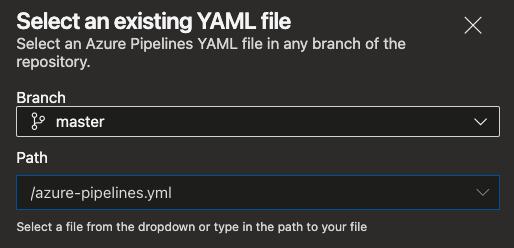
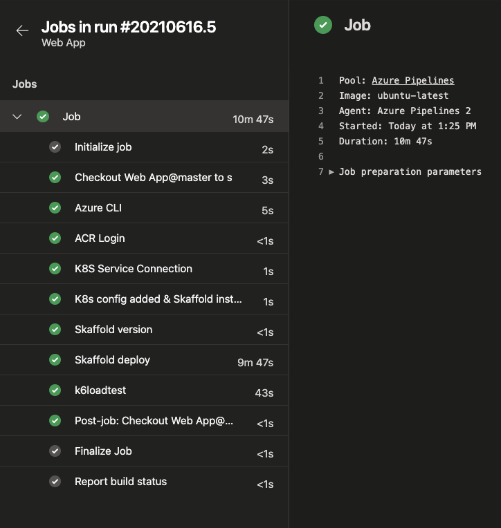

## Prerequisites
### * Verify all Terraform resources were sucessfully created on last pipeline  
### * Create a Azure DevOps Service Connection Name, this allow to connect Azure Cloud resources to Azure DevoPS solutions

## Fork the Hipster Shop repository
Fork the Hipster Shop repository from Azure Repos:
```
 https://dev.azure.com/diegogomez0768/Final%20Project/_git/Web%20App
 ```
## After the repo is forked, now you must create new pipeline 

 

Select azure repo

  

Select the repo you had fork  

  

Select Existing Azure Pipeline

  

Select pipeline yaml file

  

And push CREATE button

## After this the yaml file will be displayed on Azure Pipelines text editor

 

### The last step after your first pipeline RUN is to create some Azure Pipelines variables, from the last pipeline you must have a Azure Container Registry credentials just as:
* SKAFFOLD_DEFAULT_REPO  
This is your ACR repository URL, something just like myACR.azurecr.io
* ACR_USER  
User to access at your ACR
* ACR_PASSWORD  
Password to access at your ACR  
>*Note: This variables must be marked as SECRETS to hide values from other users*

Now you only need to *RUN* (A new commit to the selected branch will be added) your pipeline and all the microservices images will be builded and pushed to your ACR then will be deployed to your AKS cluster  

A new job should be created and finished sucessfully.

 

** Everything in (azure-pipelines.yml)[../azure-pipelines.yml] is made using Azure Pipelines Tasks, you can see this menu on a side bar next to text editor, feel free to use them for improvements